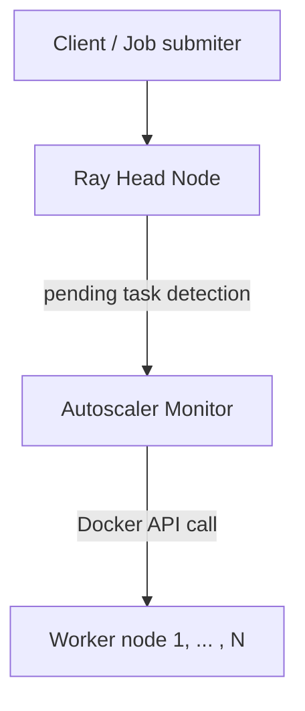

# Distributed System Final Project

Implement a resource-aware dynamic worker scaling system for ray.

## 1. Structure

```mermaid
flowchart TD
A[Client / Job submiter] --> B[Ray Head Node]
B ---> | pending task detection| C[Autoscaler Monitor]
C ---> |Docker API call| D[Worker node 1, ... , N]
```
