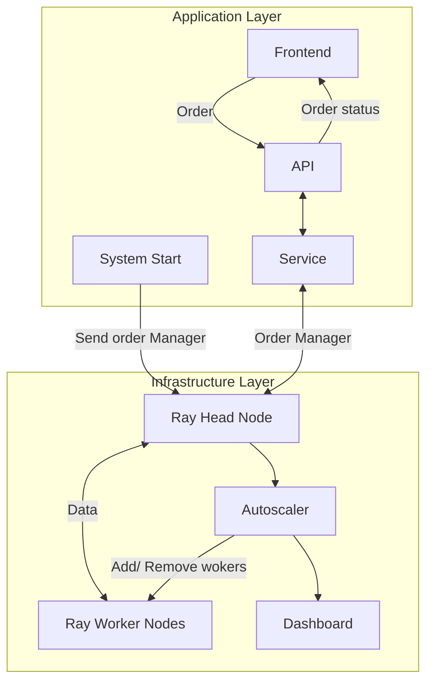
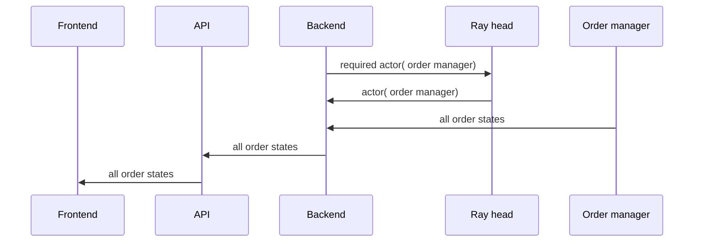
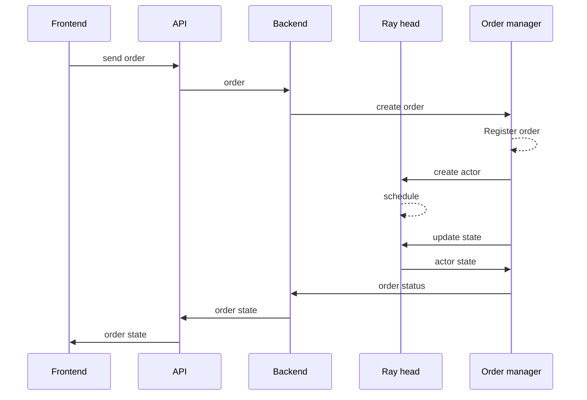

# Distributed System Final Project

Implement a resource-aware dynamic worker scaling system for ray.

## 1. Architecture




The [Autoscaler](/docs/autoscaler.md) runs as a separate process that continuously polls the Ray Dashboard API. Based on the configured scaling policy, it calls the Docker API to spin up or tear down worker containers.

## 2. Workflow 

### Monitor Service


### Order




## Getting Started

### Prerequisites
- Docker
- Python 3.11
- uv

### Install dependencies
```bash
uv sync --all-groups
```

### Update Docker dependencies
Whenever `pyproject.toml` changes, re-export before rebuilding:
```bash
uv export --no-hashes --no-group local -o docker-requirements.txt
```

### Start the cluster
```bash
docker compose up --build
```

### Start the autoscaler
```bash
uv run python -m autoscaler.main
```

### Start backend server
```bash
python -m uvicorn backend.main:app --host 0.0.0.0 --port 8000
```

### Submit a test job
```bash
uv run ray job submit \
  --address http://localhost:8265 \
  --working-dir . \
  -- python jobs/heavy_task.py
```
