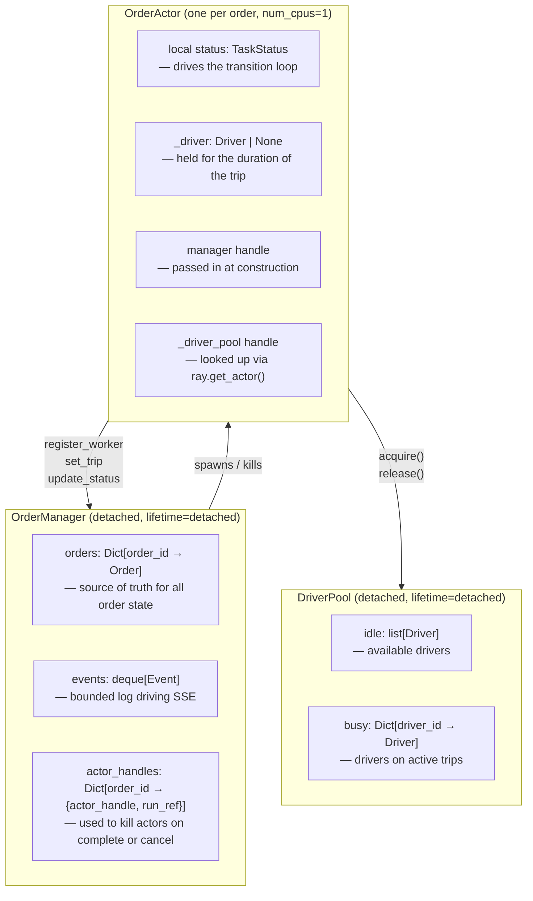
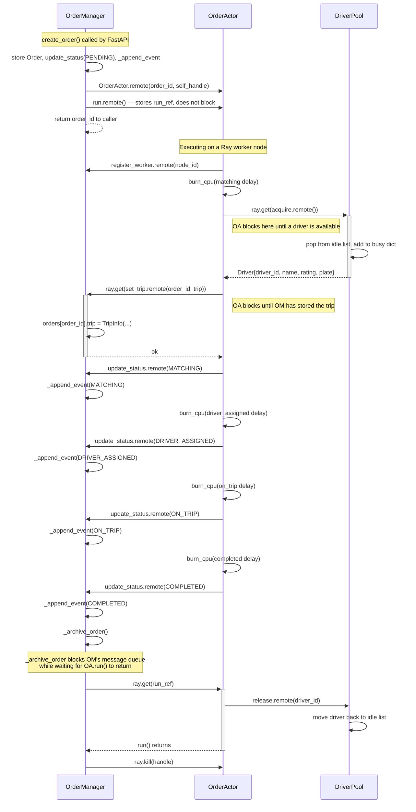
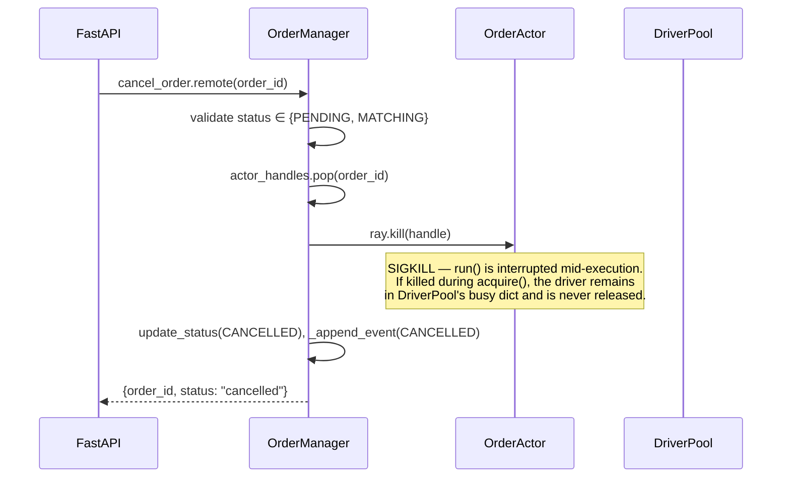

# Backend System Architecture

## Actor Interaction: OrderManager, OrderActor, and DriverPool

### Ownership and Data Responsibility

**Who owns what:**

| Actor | State it owns | Created by |
|---|---|---|
| `OrderManager` | All `Order` objects, the event log, actor handle registry | FastAPI lifespan (or reconnected on restart) |
| `OrderActor` | Its own local status copy; the `Driver` it holds during a trip | `OrderManager.create_order()` |
| `DriverPool` | The idle and busy driver pools | FastAPI lifespan (or `OrderActor.__init__` as fallback) |

---

### Normal Order Lifecycle

Solid arrows (`->>`) are fire-and-forget `.remote()` calls. Arrows with `+`/`-` activation bars are blocking `ray.get(x.remote())` calls that suspend the caller until the result is ready.

**Key blocking points:**

- `ray.get(DriverPool.acquire.remote())` in `OrderActor.run()` — OA suspends until a driver is available. If all drivers are busy this is where OA waits.
- `ray.get(manager.set_trip.remote(...))` in `OrderActor.run()` — OA waits to confirm trip info is saved before broadcasting MATCHING status.
- `ray.get(run_ref)` in `OrderManager._archive_order()` — OM's actor thread is blocked while OA finishes its last statements (`release.remote()`). During this window OM cannot process other incoming messages.

---

### Cancel Flow

Cancel can only happen when order status is `pending` or `matching`. The actor is killed immediately — no graceful shutdown.

