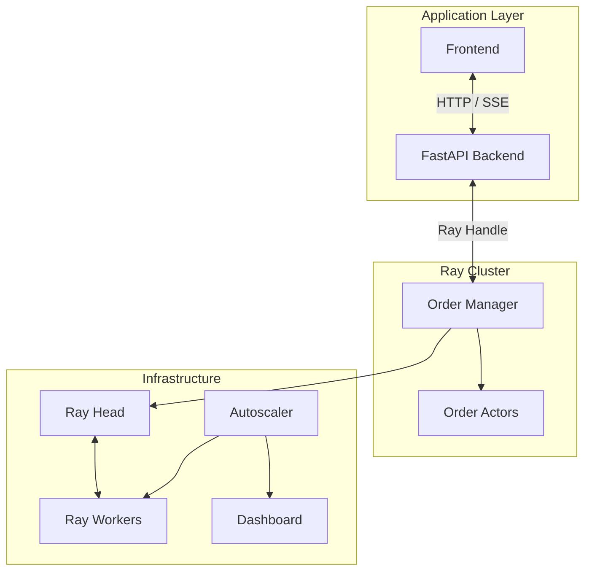
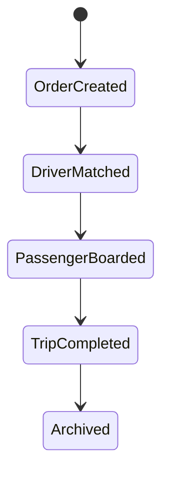
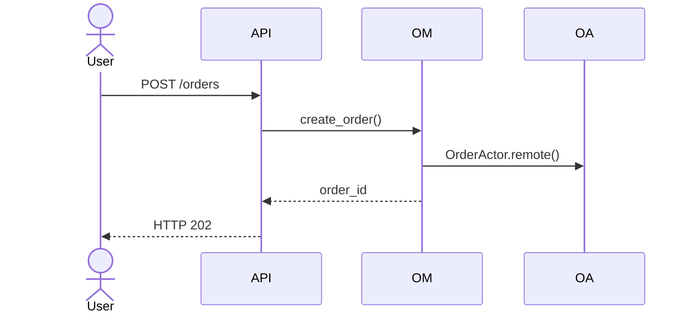
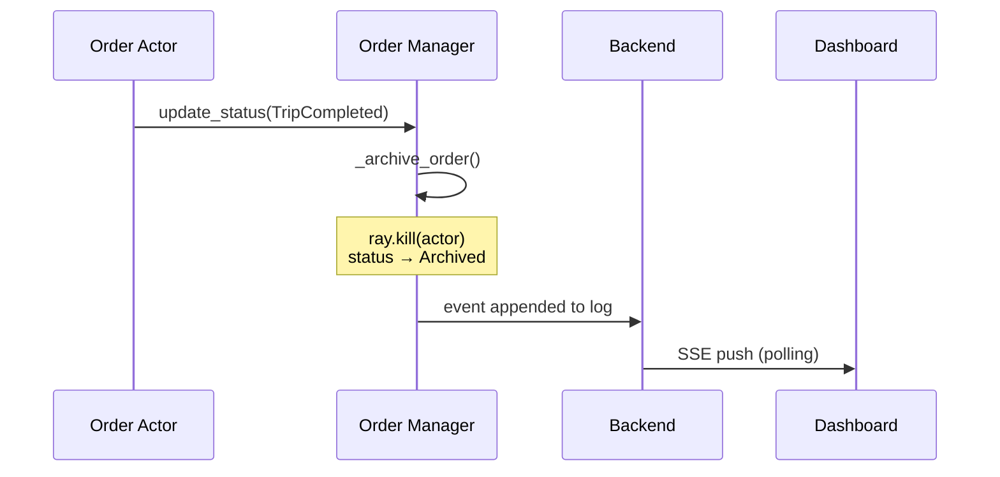
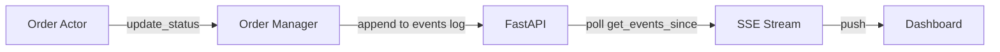

# Application Layer (Backend) to Infra Layer

## 1. Goal

Simulate an Uber-like dispatch system using Ray Actors.

Mapping:

| Ride Dispatch Concept | Ray Concept       |
| --------------------- | ----------------- |
| Ride Order            | Order Actor       |
| Driver Matching       | Ray Scheduling    |
| Driver Assigned       | Actor Scheduled   |
| Driver Busy           | Actor Running     |
| Trip Completed        | Actor Finished    |
| Driver Capacity       | Cluster Resources |
| Fleet Expansion       | Autoscaling       |

---

# 2. Architecture



---

# 3. Backend Structure

```text
backend/
├── api/
│   ├── order/
│   │   ├── create.py
│   │   └── status.py
│   │
│   └── monitor/
│       ├── dashboard.py
│       └── cluster.py
│
├── order/
│   ├── manager.py
│   └── actor.py
│
├── models.py
└── main.py
```

---

# 4. Components

## Order Manager

Responsibilities:

* Create orders and spawn Order Actors
* Maintain order state in memory
* Receive status updates from actors
* Provide query and snapshot interface
* Broadcast dashboard events via event log
* Archive completed orders (`ray.kill` + status update)

```python
class OrderManager:
    orders: Dict[str, Order]
    events: List[dict]
    actor_handles: Dict[str, ActorHandle]
```

---

## Order Actor

Responsibilities:

* Simulate ride lifecycle up to `TripCompleted`
* Update order status at each transition
* Report progress to manager

```python
@ray.remote
class OrderActor:
    ...
```

---

# 5. Order Lifecycle

## State Machine



> **Responsibility split:** `OrderActor` drives transitions from `OrderCreated` through `TripCompleted`. When `TripCompleted` is received, `OrderManager` calls `ray.kill(actor)` and transitions the order to `Archived`.

---

## Ray Mapping

| Business State   | Ray State                          |
| ---------------- | ---------------------------------- |
| OrderCreated     | `create_order()` called            |
| DriverMatched    | Actor scheduled, `run()` starts    |
| PassengerBoarded | Simulated delay inside actor       |
| TripCompleted    | Actor `run()` finishes             |
| Archived         | Manager kills actor, updates state |

---

# 6. API Contract

## Create Order

```http
POST /api/v1/orders
```

Request

```json
{
  "passenger_id": "u001",
  "pickup_location": "37.77,-122.41",
  "dropoff_location": "37.78,-122.40"
}
```

Response `202`

```json
{
  "order_id": "order_a1b2c3d4e5f6g7h8",
  "status": "OrderCreated"
}
```

---

## Query Order

```http
GET /api/v1/orders/{order_id}
```

Response `200`

```json
{
  "order_id": "order_a1b2c3d4e5f6g7h8",
  "passenger_id": "u001",
  "pickup_location": "37.77,-122.41",
  "dropoff_location": "37.78,-122.40",
  "status": "TripCompleted",
  "driver_id": null,
  "status_timestamps": {
    "OrderCreated": "2026-06-01T10:00:00",
    "DriverMatched": "2026-06-01T10:00:07"
  }
}
```

- `status_timestamps` will only contain statuses that already occurred.

---

## Dashboard Stream

```http
GET /api/v1/dashboard/stream
```

Protocol: SSE (Server-Sent Events). Each event is pushed as the order progresses through its lifecycle.

```text
event: message
data: {"order_id": "order_d39c9cd42f89402e", "status": "OrderCreated", "timestamp": "2026-05-31T21:28:10.800183"}
```

- Use stream to update frontend in real-time without polling.

---

## Dashboard Snapshot

```http
GET /api/v1/dashboard/snapshot
```

Response `200` — full state for frontend reconciliation:

```json
{
  "orders": [
    {
      "order_id": "order_a1b2c3d4e5f6g7h8",
      "passenger_id": "u001",
      "pickup_location": "37.77,-122.41",
      "dropoff_location": "37.78,-122.40",
      "status": "Archived",
      "driver_id": null,
      "status_timestamps": { ... }
    }
  ],
  "total_orders": 1
}
```

- Useful for initial load or if SSE connection is lost.

---

## Cluster Status

```http
GET /api/v1/cluster/status
```

Response `200`

```json
{
  "alive_nodes": 2,
  "cpu_used": 3.0,
  "cpu_total": 8.0,
  "gpu_used": 0.0,
  "gpu_total": 0.0,
  "pending_resources": []
}
```

---

# 7. Order Creation Flow



---

# 8. Status Update Flow



---

---

# 9. Complete Event Pipeline


