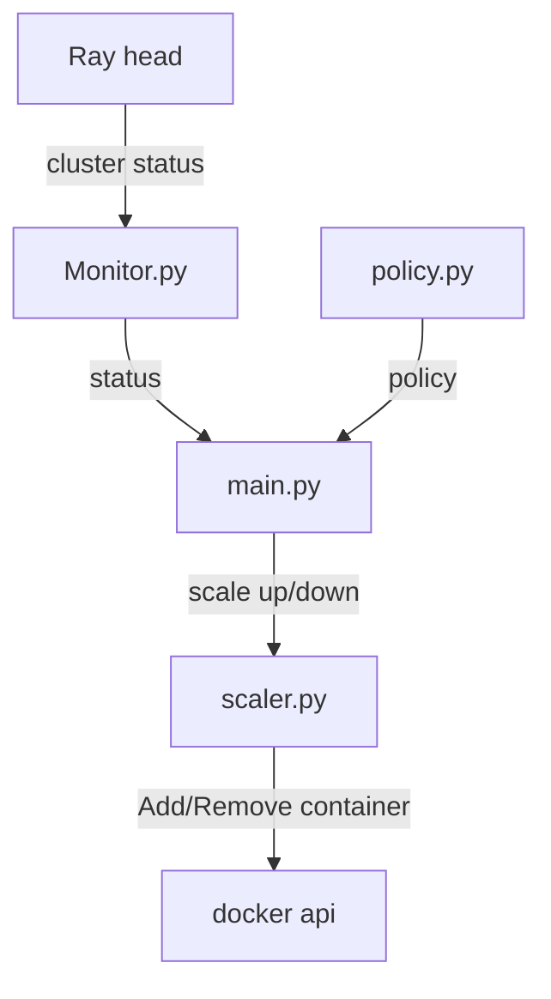

# Ray Worker Autoscaler

A dynamic worker scaling system for a Ray cluster, automatically spawning and removing Docker-based worker nodes based on task queue depth.

---

## Overview

This is a custom autoscaler for a Ray cluster deploying entirely via Docker. When the Ray head node begins queuing tasks due to insufficient resources, the autoscaler detects the backlog and dynamically launches additional worker nodes. When the load subsides, it removes idle workers to free up resources.

---

## System Architecture

---

## Components

### `autoscaler/monitor.py`
Responsible for fetching cluster state from the Ray Dashboard API.

| Function | Description |
|---|---|
| `get_cluster_status()` | Fetches the full cluster status from the Dashboard API |
| `get_pending_resources(status)` | Returns the list of pending resource demands |
| `get_cpu_usage(status)` | Returns CPU usage as a tuple of `(used, total)` |
| `get_alive_nodes()` | Returns a list of all currently alive nodes including the head node |

---

### `autoscaler/policy.py`
Defines the scaling decision logic.

**`BasePolicy`** is an abstract base class that all custom policies must inherit from. It provides:
- `_is_cooldown()` — prevents rapid repeated scaling
- `records_scale()` — records the timestamp of the last scaling action

**`ThresholdPolicy`** is the default implementation. It scales up when pending tasks persist for consecutive checks, and scales down when resource usage drops below configured thresholds.

**`load_policy(path)`** loads the policy configuration from `scale_policy.yaml`. Falls back to default `ThresholdPolicy` values if the file is not found.

---

### `autoscaler/scaler.py`
Responsible for executing scaling actions via the Docker SDK.

| Function | Description |
|---|---|
| `scale_up(worker_id)` | Launches a new worker container and joins it to the Ray cluster |
| `scale_down(worker_id)` | Stops and removes the specified worker container |

---

### `autoscaler/main.py`
The main loop that ties everything together.

```
every POLL_INTERVAL seconds:
  1. fetch cluster status from monitor
  2. evaluate scaling decision from policy
  3. execute scale up or scale down via scaler
```

---

## Configuration

### `scale_policy.yaml`
Controls the scaling behaviour. All fields are optional; missing fields fall back to default values.

```yaml
name: threshold

# minimum worker nodes
min_workers: 0

# maximum worker nodes
max_workers: 5

# cooldown time in seconds to prevent rapid scaling
cooldown: 15

# scale down threshold
cpu_scale_down_threshold: 0.1
# gpu_scale_down_threshold: 0.1

# scale up counter( if there're pending resource demands counter += 1)
scale_up_threshold: 3
```


### `.env`
Environment variables for the cluster.

---

## Docker Setup

All Ray nodes (head and workers) share the same Docker image `ray-autoscaler-node`, built from `docker/Dockerfile`. The role of each container is determined by its startup command.

| Container | Role | Startup command | Managed by |
|---|---|---| --- |
| `ray-head` | Head node | `ray start --head` | Manual `docker compose up`|
| `ray-worker-N` | Worker node | `ray start --address=ray-head:6379` | Automatic via `Autoscaler` |

All containers communicate over the `ray-autoscaler-net` Docker bridge network.

---

## Extending with a Custom Policy

To implement a custom scaling policy, inherit from `BasePolicy` and register it in `_POLICY_REGISTRY`:

```python
from autoscaler.policy import BasePolicy, _POLICY_REGISTRY

class MyPolicy(BasePolicy):
    def should_scale_up(self, pending, alive_workers):
        ...

    def should_scale_down(self, cpu_usage, gpu_usage, pending, alive_workers):
        ...

_POLICY_REGISTRY["my_policy"] = MyPolicy
```

Then set `name: my_policy` in `scale_policy.yaml`.

---

## Getting Started

### Prerequisites
- Docker
- Python 3.11
- uv

### Install dependencies
```bash
uv sync --all-groups
```

### Update Docker dependencies
Whenever `pyproject.toml` changes, re-export before rebuilding:
```bash
uv export --no-hashes --no-group local -o docker-requirements.txt
```

### Start the cluster
```bash
docker compose up --build
```

### Start the autoscaler
```bash
uv run python -m autoscaler.main
```

### Submit a test job
```bash
uv run ray job submit \
  --address http://localhost:8265 \
  --working-dir . \
  -- python jobs/heavy_task.py
```

### Verify cluster status
```bash
docker exec ray-head ray status
```
---

## Project Structure

```
ray-autoscaler/
├── autoscaler/
│   ├── __init__.py
│   ├── monitor.py
│   ├── policy.py
│   ├── scaler.py
│   └── main.py
├── docker/
│   └── Dockerfile
├── jobs/
│   ├── verify_submission.py
│   ├── verify_queueing.py
│   ├── verify_queueing_detec.py
│   ├── test_scaler.py
│   ├── test_monitor.py
│   └── heavy_task.py
├── docker-compose.yml
├── docker-requirements.txt
├── scale_policy.yaml
├── pyproject.toml
├── .rayignore
└── .env
```
